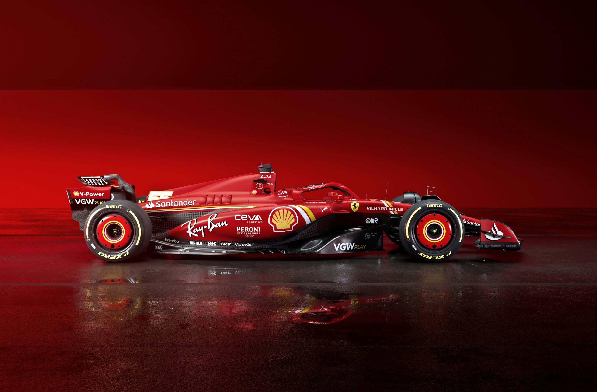

# 🏎️ Formula 1 Analytics — Power BI
##   
### 🇬🇧 English

This Power BI report explores Formula 1 performance across seasons, teams, drivers, and circuits.
It offers KPI overviews, drill-through to race level, and interactive slicing by season/team/driver/circuit.

### 🔍 What’s inside:

- Data prep (Power Query): standardized fields, fixed data types, managed nulls, derived features (e.g., stint length, pit-stop duration).
    - Model (Star-Schema):
    - Facts: Results, Laps, PitStops
    - Dimensions: Drivers, Teams, Circuits, Dates
- Key DAX measures: total points, wins/podiums, quali vs race-pace deltas, avg pit-stop time, rolling/time-intelligence KPIs.
- Report pages: Overview KPI, Team Compare, Driver Profile, Circuit Analysis, Race Drill-through.

### 📈 How to use

Open the .pbix in Power BI Desktop (latest version recommended).
Use slicers to filter by season/team/driver/circuit.
Explore drill-through on races for lap-by-lap and pit-stop context.

### <span id="head4">  Example DAX (illustrative) </span>
```bash
Total Points = SUM(Results[Points])
Podiums = CALCULATE(COUNTROWS(Results), Results[Position] <= 3)
Avg Pit Stop (s) = AVERAGE(PitStops[DurationSeconds])
```

### 🇮🇹 Italiano

Questo report Power BI analizza le prestazioni di Formula 1 per stagioni, scuderie, piloti e circuiti.
Offre KPI di sintesi, drill-through a livello di gara e slicer interattivi per stagione/team/pilota/circuito.

### 🔍 Contenuti
- Preparazione dati (Power Query): normalizzazione campi, correzione tipi, gestione valori mancanti, variabili derivate (es. durata stint, tempi ai box).
    - Modello (Schema a Stella):
    - Fatti: Results, Laps, PitStops
    - Dimensioni: Drivers, Teams, Circuits, Dates
- Misure DAX chiave: punti totali, vittorie/podi, delta passo qualifica-gara, tempo medio ai box, indicatori rolling/time-intelligence.
- Pagine report: KPI Overview, Confronto Team, Profilo Pilota, Analisi Circuiti, Drill-through Gara.

### 📈 Come usarlo

Apri il .pbix con Power BI Desktop (versione aggiornata consigliata).
Filtra con gli slicer per stagione/team/pilota/circuito.
Entra nel drill-through delle gare per vedere giri e pit-stop nel contesto.

### <span id="head4">  Esempio DAX (dimostrativo) </span>
```bash
Punti Totali = SUM(Results[Points])
Podi = CALCULATE(COUNTROWS(Results), Results[Position] <= 3)
Pit Stop Medio (s) = AVERAGE(PitStops[DurationSeconds])
```
